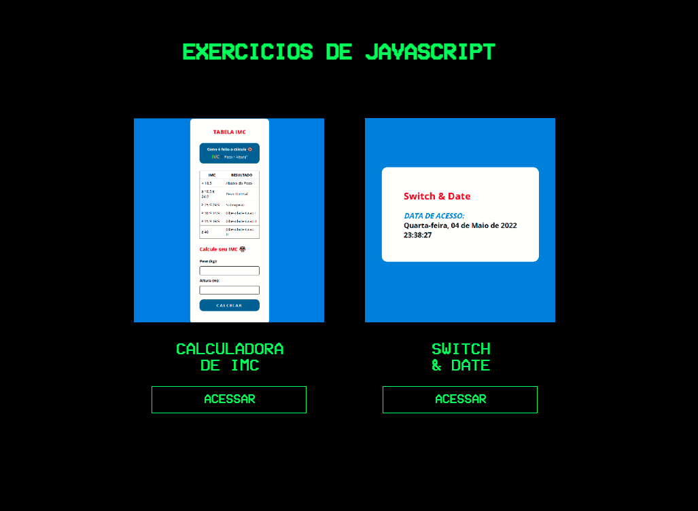

# Exercícios - Javascript 

*Local para postar meus exercícios de Javascript*

 

  

 

🔗 <a href="https://jeanpcb.github.io/Exercicios-JS/"> Clique aqui pra conferir</a> 😉

- **Linguagem foco:**  
✔ Javascript 

**(Espero que tenha lido o título...)**

## Objetivo

Muitas vezes você tem exercícios interessantes feitos, mas não acha necessário criar um repositório pra cada "exerciciozinho" feito, não?

Então, eu fiz esse repositório pensando nisso.

Aqui eu consigo arquivar meus exercícios de JavaScript, sendo uma ótima maneira de manter um backup e também um local pra compartilhar um pouco dos meus avanços dentro da linguagem.
